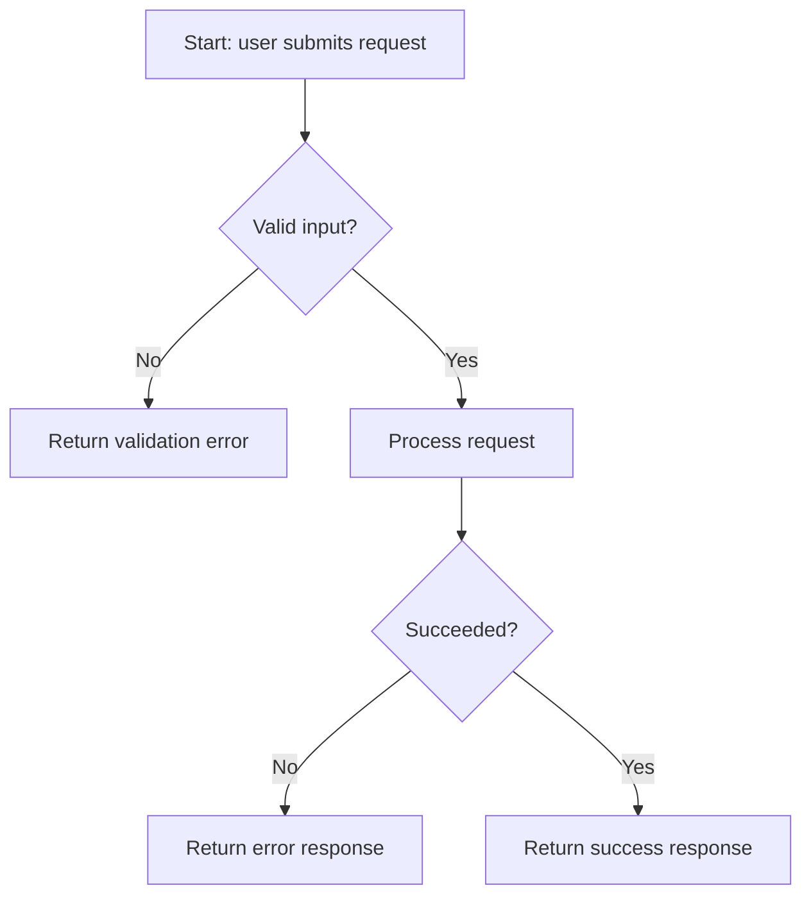
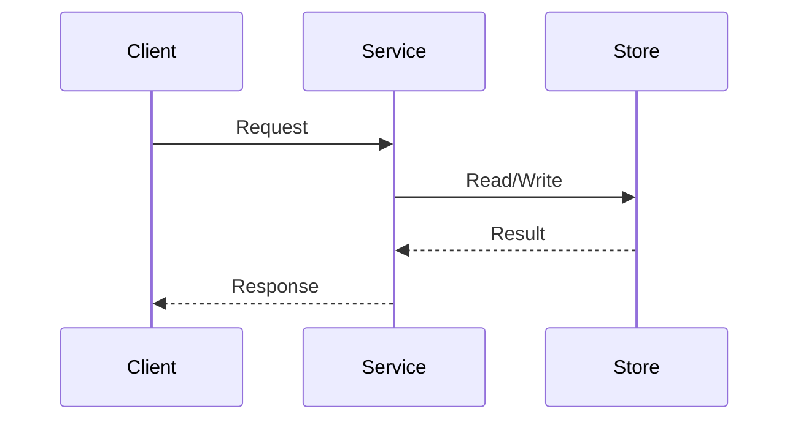
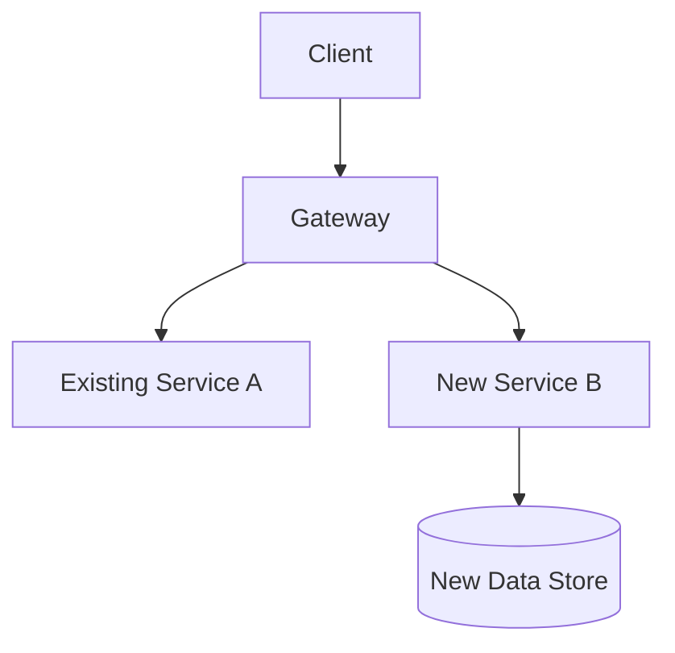
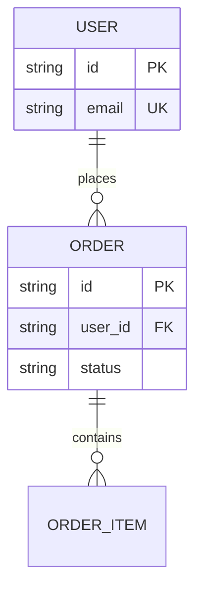

# Diagram Guide (Step 2)

Which Mermaid diagram types a proposal needs, and why - don't draw a diagram type that doesn't apply
to the change's actual scope; an unnecessary diagram adds noise, not clarity.

## Always Required

### Flow Diagram
Describes the logic/decision path for the feature's main behavior - required for every proposal,
because it's the fastest way for a reviewer to verify the logic matches the requirements before any
code exists.

### Sequence Diagram
Describes the interaction between actors/components over time - required for every proposal, because
it's what actually catches missing steps, wrong call order, or an unhandled async/error path that a
flow diagram alone won't surface.

## Conditionally Required

### Architecture Diagram / Component Diagram
Required only if the proposal changes system boundaries or adds/removes a service or module. Skip it
if the change is internal to one existing module/component with no structural change - a diagram that
just re-draws the unchanged existing architecture doesn't add information.

### Entity-Relationship Diagram (ERD)
Required only if the proposal changes the data model/schema (new table/collection, new relationship, a
changed field that affects other data). Skip it if the change touches no persisted data shape.

## Decision Checklist

| Diagram | Required when | Skip when |
|---------|----------------|-----------|
| Flow | Always | Never |
| Sequence | Always | Never |
| Architecture/Component | System boundaries change, service/module added or removed | Purely internal change to one existing module |
| ERD | Data model/schema changes | No persisted data shape is touched |

If more than one proposal is on the table (Step 2.3), draw diagrams for each proposal separately - a
diagram that's shared across proposals as if they were identical usually means the proposals aren't
actually different enough to present separately.
